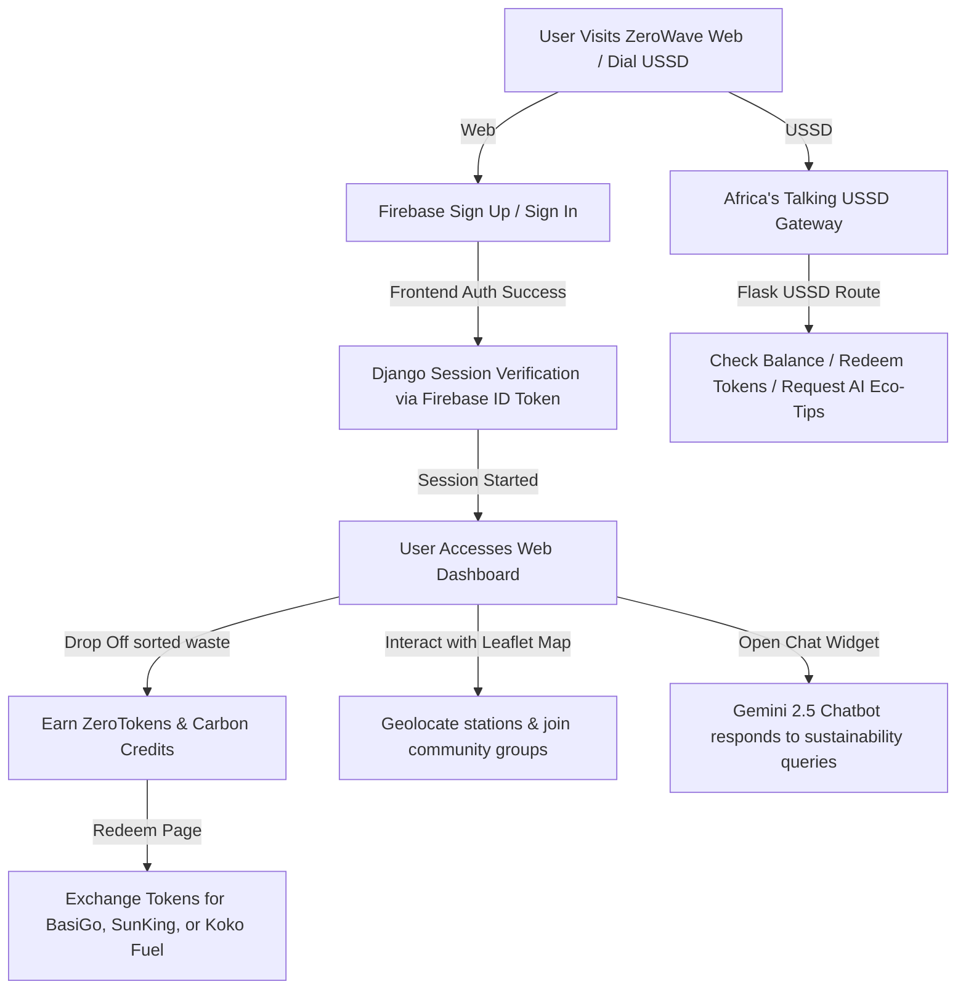

# ZeroWave — Sustainability & Waste-to-Energy Platform

ZeroWave is a full-stack sustainability platform designed to incentivize responsible waste management, promote waste-to-energy conversion (biogas, recycling), and build eco-friendly communities. Users earn **ZeroTokens** by dropping off segregated waste at collection points, which they can redeem for green rewards like electric bus transport discounts (BasiGo), solar lighting (SunKing), solar power tokens (KPLC), and clean cooking fuel (Koko Fuel).

ZeroWave features a premium, responsive web interface equipped with an interactive AI Chatbot (powered by Gemini) and Leaflet maps for geolocating collection hubs. It also offers a low-connectivity USSD sub-module for users with basic mobile phones or poor internet access.

---

## 1. Aim of the Project

The primary goal of ZeroWave is to democratize environmental conservation and waste-to-energy initiatives in East Africa. By combining financial incentives (ZeroTokens and carbon credits) with accessible tools (low-bandwidth USSD interfaces and advanced web diagnostics), ZeroWave drives behavioral change towards a circular economy and clean energy transformation.

---

## 2. Prerequisites

To install, configure, and run ZeroWave locally, ensure you have:

* **Python 3.10+** installed on your system.
* A **Google Gemini API Key** (to power the sustainability chatbot and USSD automated SMS alert generator).
* A **Firebase Project** account (to manage user signups and authentication).
* An **Africa's Talking API key** and Sandbox setup (optional, for running the USSD gateway).
* An **Opik** account (optional, for LLM tracing and observability).

---

## 3. Tools and Technologies Used

* **Web Backend**: Django 4.x (Python 3)
* **Web Frontend**: HTML5, Vanilla JavaScript, CSS3 (Comfort HSL-tailored Dark/Light Mode themes), Bootstrap 5, FontAwesome Icons
* **Database**: SQLite (Local development default), Django ORM support for PostgreSQL/Supabase
* **User Authentication**: Client-side Firebase Authentication verified securely on the Django backend via `firebase-admin` SDK
* **AI Model Integrations**: Google GenAI SDK (`gemini-2.5-flash` model for chat assistance and dynamic SMS alerts)
* **USSD/SMS Gateway**: Flask-based sub-module integrating with Africa's Talking API
* **Observability & Analytics**: Opik SDK (for tracking AI generator trace steps)
* **Geospatial Mapping**: Leaflet.js (for Nairobi collection hubs maps)
* **Data Visualization**: Chart.js (interactive line, bar, doughnut, and radar charts for waste metrics)

---

## 4. Directory Structure

```
ZeroWave/
│
├── manage.py                     # Django management script
├── requirements.txt              # Project python dependencies
├── db.sqlite3                    # Local SQLite database
├── firebase-credentials.json      # Firebase Service Account Credentials
│
├── ZeroWave/                     # Django Settings package
│   ├── __init__.py
│   ├── asgi.py
│   ├── settings.py               # Django configuration, database & Firebase setup
│   ├── urls.py                   # Django root URL routing
│   └── wsgi.py                   # WSGI server entry point
│
├── ZeroWave_app/                 # Main django app package
│   ├── admin.py
│   ├── apps.py
│   ├── models.py                 # Standard models placeholder (uses Firebase UID mapping)
│   ├── urls.py                   # App URL routing (/dashboard, /rewards, /analytics, etc.)
│   ├── views.py                  # Django Views, Firebase token verification, & Gemini chatbot integrations
│   │
│   ├── templates/                # Django HTML templates (Light/Dark Comfort Theme support)
│   │   ├── index.html            # Landing / Marketing Page
│   │   ├── signin.html           # Firebase email/password Login Page
│   │   ├── registration.html     # Firebase Signup Page
│   │   ├── dashboard.html        # Main user stats, trends & recent activities panel
│   │   ├── rewards.html          # Redemptions list & impact metrics
│   │   ├── analytics.html        # Detailed analytics dashboard with Leaflet map
│   │   ├── nearby.html           # Waste stations locator map
│   │   ├── community.html        # Community Groups & carbon marketplace
│   │   ├── settings.html         # User settings panel
│   │   ├── sidebar.html          # Reusable navigation sidebar
│   │   └── chatbox.html          # Reusable floating Gemini AI chat widget
│   │
│   └── ZeroWave_ussd/            # USSD interface gateway
│       ├── ussd.py               # Flask app exposing USSD routes for Africa's Talking
│       └── ussd_response/
│           ├── ai_response.py    # Auto-generates eco-tips SMS via Gemini 2.5 Flash
│           └── sms_resposne.py   # Sends messages using Africa's Talking API
│
└── static/                       # Custom CSS, JS, and image assets
```

---

## 5. Workflow of the Project



1. **User Auth Flow**: Users sign up/in using Firebase Auth. The client token is verified on Django via `/auth/firebase/` where a matching Django User profile is created.
2. **Earning Tokens**: Users drop off classified waste (Organic, E-waste, Recyclables, Agriculture) at stations. Once recorded, stats reflect on their personal dashboard, granting them ZeroTokens.
3. **Analytics & Map Navigation**: Users explore regional waste trends (via Chart.js) and geolocate empty or full drop-off hubs on a Leaflet Nairobi Map.
4. **Community Engagement**: Users can join local environment initiatives and trade carbon offset credits in the built-in marketplace.
5. **Reward Redemption**: Users spend ZeroTokens to acquire coupon discounts for electric buses, clean stoves, solar tokens, or smart lighting.
6. **Gemini chatbot**: Users get instant advice on renewable energy or recycling steps from the green AI Chatbot overlay.
7. **Offline USSD Capability**: Dialing the USSD shortcode allows users to access basic functions, report illegal dumping, and request AI-generated sustainability tips sent directly via SMS.

---

## 6. How to Run this Project Step by Step

### Step 1: Clone and Set Up Environment

1. Navigate to the project directory:
   ```bash
   cd ZeroWave
   ```
2. Create a Python virtual environment and activate it:
   ```bash
   python -m venv venv
   # On Windows:
   .\venv\Scripts\activate
   # On macOS/Linux:
   source venv/bin/activate
   ```
3. Install the required python dependencies:
   ```bash
   pip install -r requirements.txt
   ```

### Step 2: Configure Environment Variables

Create a `.env` file in the root directory containing the following:

```env
# Gemini configuration
GOOGLE_API_KEY=your_gemini_api_key

# Firebase config
FIREBASE_API_KEY=your_firebase_api_key
FIREBASE_AUTH_DOMAIN=your_project.firebaseapp.com
FIREBASE_PROJECT_ID=your_firebase_project_id
FIREBASE_STORAGE_BUCKET=your_project.appspot.com
FIREBASE_MESSAGING_SENDER_ID=your_sender_id
FIREBASE_APP_ID=your_app_id

# Africa's Talking SMS/USSD config
AT_API_KEY=your_africas_talking_api_key
```

### Step 3: Configure Firebase SDK Service Credentials

Download your Firebase project's service account credentials JSON file, rename it to `firebase-credentials.json`, and place it in the root folder of the project.

### Step 4: Run Migrations and Initialize Database

Generate tables for Django Session management and user lookup mapping:

```bash
python manage.py migrate
```

### Step 5: Run the Web Server

Launch the Django development web server:

```bash
python manage.py runserver
```

Open `http://127.0.0.1:8000/` in your browser.

### Step 6: Run the USSD Gateway (Optional)

Start the USSD gateway Flask application:

```bash
python ZeroWave_app/ZeroWave_ussd/ussd.py
```

This launches a listener on `http://127.0.0.1:8000/ussd` that can be mapped to Africa's Talking Sandbox using a proxy tool like ngrok.

---

## 7. Sample Input and Output Data

### Web Chatbot Interaction

* **Sample Input**: *"How much energy does anaerobic digestion produce from food waste?"*
* **Sample Output**: *"Anaerobic digestion typically yields about 80 to 120 cubic meters of biogas per ton of organic food waste. This biogas, consisting of roughly 60% methane, translates to approximately 140 to 200 kWh of electricity, or enough thermal energy to power domestic biogas cooking stoves for several hours. The remaining digestate serves as rich bio-fertilizer."*

### USSD Interaction

* **Sample Input (Service Request)**: User dials `*384*20880#` (Simulated via Africa's Talking)
* **Sample Output (USSD response)**:
  ```
  CON Welcome to ZeroWave, Turning Waste to Energy 
  1. Register 
  2. ZeroTokens 
  3. Community 
  4. Locate Stations 
  5. Get Tips & Alerts 
  6. Report 
  7. About ZeroWave 
  ```

### SMS Alerts (via Gemini USSD Action)

* **Sample Input (Selection)**: User inputs `5` (Get Tips & Alerts)
* **Sample Output (SMS sent to User)**: *"Did you know? Segregating organic food waste keeps it out of landfills, reducing methane emissions by up to 40%. Start sorting to earn ZeroTokens today! 🌍"*

---

## 8. Advantages

* **Low-Connectivity Inclusion**: The USSD integration guarantees that offline citizens or those with older mobile phones can participate in recycling campaigns and check balances.
* **Double-Value Incentive Hook**: Users get concrete utility rewards (clean fuel and solar power vouchers) while supporting carbon-neutral projects, promoting localized environmental action.
* **Smart Eco-Consultant**: The custom-prompted Gemini AI model delivers expert, targeted sustainability counseling and rotates daily SMS energy tips.
* **Traceable AI Performance**: Fully integrated with Opik to monitor generative response performance, cost, and reliability.
* **Interactive Mapping**: Leaflet maps and dynamic charts provide clear feedback on regional collection points, waste breakdowns, and illegal dumping spots.

---

## 9. What are Future Implementations that Can Be Done?

* **Production USSD Shortcode Launch**: Bind the Africa's Talking endpoint to a live telecom shortcode in Kenya.
* **Integrated M-Pesa Cash-Outs**: Replace mock coupon vouchers with direct mobile money (M-Pesa/PayHero) micro-payments.
* **Computer Vision Bins**: Implement image recognition (using Gemini Multimodal API) allowing users to snapshot items and get automated instructions on which bin to segregate them into.
* **IoT Smart Bin Network**: Connect physical ultrasonic distance sensors inside community bins to automatically reflect bin fullness (Empty, pre-occupied, full) on the interactive web maps.
* **Blockchain Carbon Tokenization**: Convert user reward points into verified tokenized carbon offsets on a public blockchain ledger for secure global trading.

---

## 10. Conclusion

ZeroWave sits at the intersection of digital accessibility and green innovation. By offering a high-fidelity analytics dashboard alongside an offline-friendly USSD gateway, the platform removes barriers to entry for waste recycling. Supported by Google's generative models and robust monitoring tools, ZeroWave equips grass-roots users with both the knowledge and the tangible rewards required to transition East African urban centers into sustainable, circular hubs.
